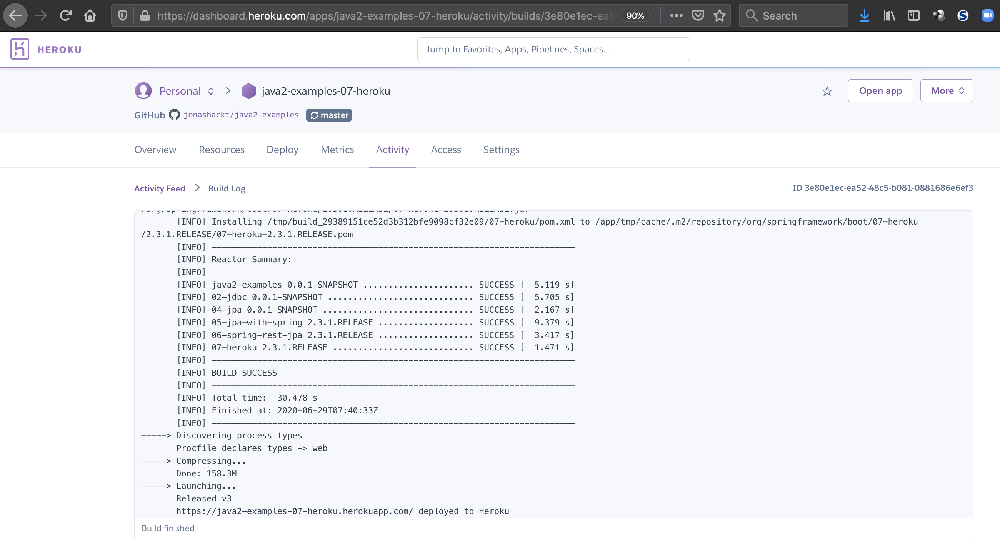

# java2-examples: 07-heroku
[](https://java2-examples-07-heroku.herokuapp.com/swagger-ui.html)

Example showing how to deploy our Spring Boot App to Heroku


See the docs: 
* https://devcenter.heroku.com/articles/getting-started-with-java
* https://devcenter.heroku.com/articles/intro-for-java-developers
* https://devcenter.heroku.com/articles/github-integration 


### Howto:


#### 1. Heroku CLI installieren 

Mac: `brew install heroku`

Windows: `choco install heroku-cli`


#### 2. Heroku App erstellen

In der Web-GUI oder über die CLI:

`heroku apps:create java2-examples-07-heroku`


#### 3. Heroku App mit GitHub verbinden

Am einfachsten über die Web-GUI:


#### 4. Enable automatic deploys from GitHub

Auch Web-GUI: Automatic deploys aktivieren und Haken bei `Wait for CI to pass before deploy` setzen.


#### 5. Optional, falls ihr nicht JDK8 einsetzt

Erstellt eine `system.properties` Datei (siehe https://devcenter.heroku.com/articles/customizing-the-jdk) mit euer Java-Version:

```
java.runtime.version=11
```

Sonst lauf ihr in folgenden Fehler auf Heroku:

```
       [ERROR] Failed to execute goal org.apache.maven.plugins:maven-compiler-plugin:3.8.1:compile (default-compile) on project 02-jdbc: Fatal error compiling: invalid target release: 11 -> [Help 1]
```

#### 6. Procfile anlegen im Repository

In eurem Repository müsst ihr eine Konfigurationsdatei für Heroku anlegen, die `Procfile` heißt:

```
web: java -Dserver.port=$PORT -jar 07-heroku/target/07-heroku-1.0.0-SNAPSHOT.jar
```

Wichtig ist der Pfad am Ende - verweisst da auf eure von Maven gebaute Spring Boot App, die als `.jar` Datei vorliegt.


#### 6. Pushed die Files in euer GitHub-Repository & folgt dem Heroku-Deploy-Log




#### 7. Finish! Ruft euer App auf im Netz!

Z.B. über https://java2-examples-07-heroku.herokuapp.com/swagger-ui.html


#### 8. Bindet die Heroku Postgres Datenbank an

Hier ist ein vollständiger Guide: https://stackoverflow.com/questions/33633243/connecting-to-heroku-postgres-from-spring-boot/49978310#49978310