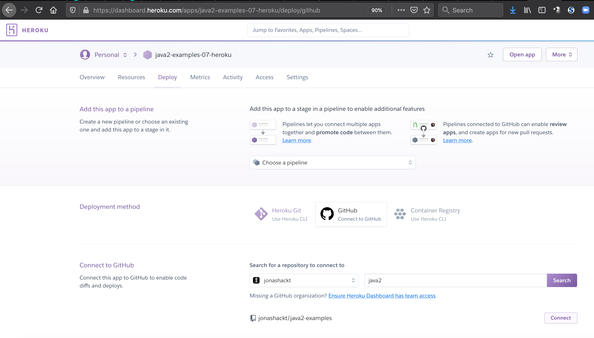

# java2-examples: 07-heroku
Example showing how to deploy our Spring Boot App to Heroku


See the docs: 
* https://devcenter.heroku.com/articles/getting-started-with-java
* https://devcenter.heroku.com/articles/intro-for-java-developers
* https://devcenter.heroku.com/articles/github-integration 


### Howto:

#### 1. Procfile anlegen im Repository

In eurem Repository müsst ihr eine Konfigurationsdatei für Heroku anlegen, die `Procfile` heißt:

```
web: java -Dserver.port=$PORT -jar 07-heroku/target/07-heroku-1.0.0-SNAPSHOT.jar
```

Wichtig ist der Pfad am Ende - verweisst da auf eure von Maven gebaute Spring Boot App, die als `.jar` Datei vorliegt.


#### 2. Heroku CLI installieren 

Mac: `brew install heroku`

Windows: `choco install heroku-cli`


#### 3. Heroku App erstellen

In der Web-GUI oder über die CLI:

`heroku apps:create java2-examples-07-heroku`


#### 4. Heroku App mit GitHub verbinden

Am einfachsten über die Web-GUI:




#### 5. Enable automatic deploys from GitHub

Auch Web-GUI: Automatic deploys aktivieren und Haken bei `Wait for CI to pass before deploy` setzen.